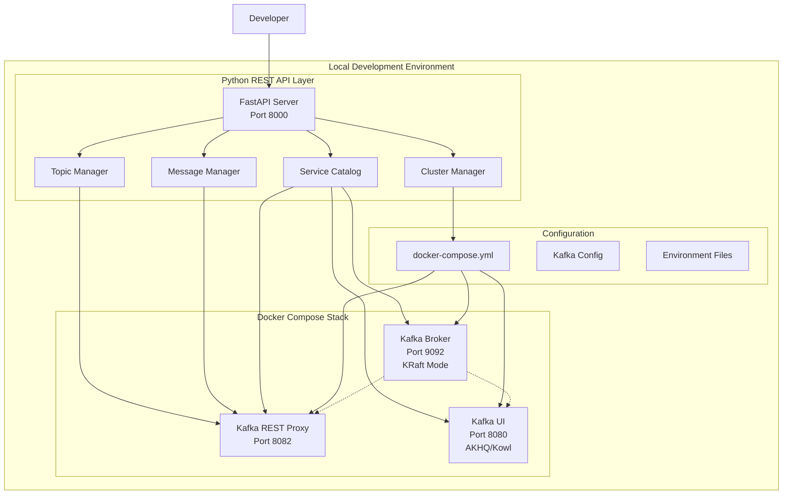

# Design Document

## Overview

The Local Kafka Manager is a Python-based REST API service that orchestrates a complete Kafka development stack using Docker Compose. The system provides programmatic control over Kafka cluster lifecycle, topic management, message operations, and includes a web-based UI for visual management. All components run locally without external dependencies.

## Architecture



## Components and Interfaces

### 1. FastAPI REST Server

**Purpose:** Main API gateway providing HTTP endpoints for all operations

**Key Interfaces:**
- `/catalog` - GET: Returns service catalog with real-time status
- `/cluster/start` - POST: Starts Docker Compose stack
- `/cluster/stop` - POST: Stops all services
- `/cluster/status` - GET: Returns cluster health and status
- `/topics` - GET/POST: List and create topics
- `/topics/{name}` - DELETE: Remove specific topic
- `/produce` - POST: Send messages to topics
- `/consume` - GET: Retrieve messages from topics

**Technology Stack:**
- FastAPI for async HTTP server with auto-generated OpenAPI docs
- Pydantic for request/response validation
- Python Docker SDK for container management
- Kafka-Python for direct Kafka operations

### 2. Cluster Manager Component

**Purpose:** Orchestrates Docker Compose lifecycle and monitors service health

**Responsibilities:**
- Execute `docker-compose up/down` commands
- Monitor container status and health checks
- Manage service dependencies and startup order
- Handle error conditions and cleanup

**Key Methods:**
```python
class ClusterManager:
    async def start_cluster() -> ClusterStatus
    async def stop_cluster() -> bool
    async def get_status() -> ClusterStatus
    async def health_check() -> Dict[str, ServiceHealth]
```

### 3. Topic Manager Component

**Purpose:** Handles Kafka topic lifecycle operations

**Responsibilities:**
- Create/delete topics via Kafka Admin API
- Validate topic configurations
- List existing topics with metadata
- Handle topic-level permissions and quotas

**Key Methods:**
```python
class TopicManager:
    async def list_topics() -> List[TopicInfo]
    async def create_topic(config: TopicConfig) -> bool
    async def delete_topic(name: str) -> bool
    async def get_topic_metadata(name: str) -> TopicMetadata
```

### 4. Message Manager Component

**Purpose:** Handles message production and consumption via Kafka REST Proxy

**Responsibilities:**
- Proxy produce requests to Kafka REST Proxy
- Manage consumer groups and offsets
- Handle message serialization/deserialization
- Provide message filtering and pagination

**Key Methods:**
```python
class MessageManager:
    async def produce_message(topic: str, message: dict) -> ProduceResult
    async def consume_messages(topic: str, group: str) -> List[Message]
    async def get_consumer_groups() -> List[ConsumerGroup]
```

### 5. Service Catalog Component

**Purpose:** Provides real-time discovery of services and API capabilities

**Responsibilities:**
- Aggregate status from all running services
- Generate API endpoint documentation
- Provide service endpoint URLs
- Track topic and consumer group metadata

**Key Methods:**
```python
class ServiceCatalog:
    async def get_catalog() -> CatalogResponse
    async def refresh_status() -> None
    async def get_api_specs() -> Dict[str, APISpec]
```

## Data Models

### Core Data Structures

```python
from pydantic import BaseModel
from typing import List, Dict, Optional
from enum import Enum

class ServiceStatus(str, Enum):
    RUNNING = "running"
    STOPPED = "stopped"
    STARTING = "starting"
    ERROR = "error"

class ClusterStatus(BaseModel):
    status: ServiceStatus
    broker_count: int
    version: str
    endpoints: Dict[str, str]
    uptime: Optional[int]

class TopicConfig(BaseModel):
    name: str
    partitions: int = 1
    replication_factor: int = 1
    config: Dict[str, str] = {}

class TopicInfo(BaseModel):
    name: str
    partitions: int
    replication_factor: int
    size_bytes: Optional[int]

class Message(BaseModel):
    topic: str
    partition: int
    offset: int
    key: Optional[str]
    value: dict
    timestamp: int

class ProduceRequest(BaseModel):
    topic: str
    key: Optional[str]
    value: dict
    partition: Optional[int]

class ConsumeRequest(BaseModel):
    topic: str
    consumer_group: str
    max_messages: int = 10
    timeout_ms: int = 5000

class CatalogResponse(BaseModel):
    cluster: ClusterStatus
    topics: List[TopicInfo]
    available_apis: List[Dict[str, str]]
    services: Dict[str, ServiceStatus]
```

## Docker Compose Configuration

### Service Definitions

```yaml
version: '3.8'
services:
  kafka:
    image: confluentinc/cp-kafka:7.4.0
    hostname: kafka
    container_name: kafka
    ports:
      - "9092:9092"
      - "9101:9101"
    environment:
      KAFKA_NODE_ID: 1
      KAFKA_LISTENER_SECURITY_PROTOCOL_MAP: 'CONTROLLER:PLAINTEXT,PLAINTEXT:PLAINTEXT'
      KAFKA_ADVERTISED_LISTENERS: 'PLAINTEXT://localhost:9092'
      KAFKA_PROCESS_ROLES: 'broker,controller'
      KAFKA_CONTROLLER_QUORUM_VOTERS: '1@kafka:29093'
      KAFKA_LISTENERS: 'PLAINTEXT://kafka:29092,CONTROLLER://kafka:29093'
      KAFKA_INTER_BROKER_LISTENER_NAME: 'PLAINTEXT'
      KAFKA_CONTROLLER_LISTENER_NAMES: 'CONTROLLER'
      KAFKA_LOG_DIRS: '/tmp/kraft-combined-logs'
      CLUSTER_ID: 'MkU3OEVBNTcwNTJENDM2Qk'
    volumes:
      - kafka-data:/tmp/kraft-combined-logs

  kafka-rest-proxy:
    image: confluentinc/cp-kafka-rest:7.4.0
    depends_on:
      - kafka
    ports:
      - "8082:8082"
    environment:
      KAFKA_REST_HOST_NAME: kafka-rest-proxy
      KAFKA_REST_BOOTSTRAP_SERVERS: 'kafka:29092'
      KAFKA_REST_LISTENERS: "http://0.0.0.0:8082"

  kafka-ui:
    image: provectuslabs/kafka-ui:latest
    depends_on:
      - kafka
    ports:
      - "8080:8080"
    environment:
      KAFKA_CLUSTERS_0_NAME: local
      KAFKA_CLUSTERS_0_BOOTSTRAPSERVERS: kafka:29092

volumes:
  kafka-data:
```

## Error Handling

### Error Categories and Responses

1. **Service Unavailable Errors**
   - Docker not running
   - Containers failed to start
   - Network connectivity issues

2. **Kafka Operation Errors**
   - Topic creation failures
   - Message production errors
   - Consumer group issues

3. **Validation Errors**
   - Invalid topic configurations
   - Malformed message payloads
   - Missing required parameters

### Error Response Format

```python
class ErrorResponse(BaseModel):
    error: str
    message: str
    details: Optional[Dict[str, Any]]
    timestamp: str
    request_id: str

# Example error responses
{
    "error": "SERVICE_UNAVAILABLE",
    "message": "Docker is not running or not accessible",
    "details": {"service": "docker", "command": "docker ps"},
    "timestamp": "2024-01-15T10:30:00Z",
    "request_id": "req_123456"
}
```

### Retry and Recovery Strategies

- **Container startup**: Exponential backoff with max 3 retries
- **Kafka operations**: Circuit breaker pattern with 30s timeout
- **Health checks**: Periodic monitoring with automatic recovery attempts
- **Network errors**: Immediate retry with fallback to cached status

## Testing Strategy

### Unit Testing

**Scope:** Individual components and business logic
- Mock Docker SDK calls for cluster operations
- Mock Kafka client for topic/message operations
- Test data model validation and serialization
- Test error handling and edge cases

**Tools:** pytest, pytest-asyncio, unittest.mock

### Integration Testing

**Scope:** Component interactions and external dependencies
- Test Docker Compose orchestration
- Test Kafka REST Proxy integration
- Test end-to-end API workflows
- Test service discovery and health monitoring

**Setup:** Test containers with isolated Docker networks

### API Testing

**Scope:** HTTP endpoint behavior and contracts
- Test all REST endpoints with various inputs
- Test OpenAPI schema compliance
- Test authentication and authorization
- Test rate limiting and error responses

**Tools:** pytest with httpx client, OpenAPI validators

### Performance Testing

**Scope:** System behavior under load
- Message throughput testing
- Concurrent API request handling
- Container startup/shutdown timing
- Memory and CPU usage profiling

**Tools:** locust for load testing, pytest-benchmark

### Test Data Management

```python
# Test fixtures for consistent test data
@pytest.fixture
def sample_topic_config():
    return TopicConfig(
        name="test-topic",
        partitions=3,
        replication_factor=1
    )

@pytest.fixture
def sample_messages():
    return [
        {"key": "user1", "value": {"action": "login", "timestamp": 1642234567}},
        {"key": "user2", "value": {"action": "logout", "timestamp": 1642234568}}
    ]
```

### Continuous Integration

- Automated test execution on code changes
- Docker image building and testing
- Integration test environment provisioning
- Test coverage reporting and quality gates