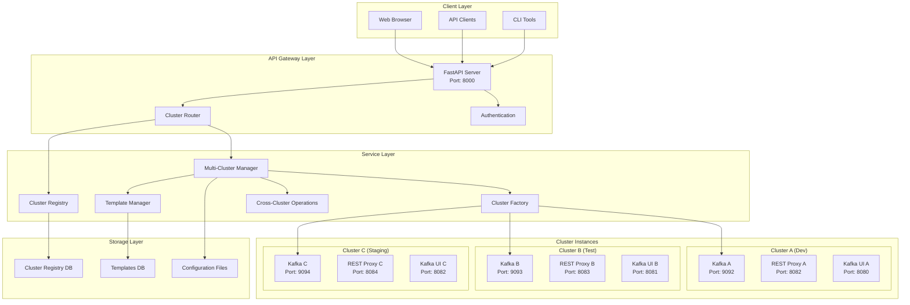

# Multi-Cluster Support Design Document

## Overview

This design document outlines the architecture and implementation approach for adding multi-cluster support to the Local Kafka Manager. The solution will enable users to manage multiple isolated Kafka clusters simultaneously while maintaining the simplicity and ease of use of the current single-cluster system.

## Architecture

### High-Level Architecture



### Component Design

#### 1. Cluster Registry

**Purpose**: Central registry for managing cluster definitions and metadata.

```python
class ClusterRegistry:
    """Central registry for managing multiple Kafka clusters."""
    
    def __init__(self, storage_backend: StorageBackend):
        self.storage = storage_backend
        self._clusters: Dict[str, ClusterDefinition] = {}
        self._active_clusters: Dict[str, ClusterManager] = {}
    
    async def register_cluster(self, definition: ClusterDefinition) -> bool:
        """Register a new cluster definition."""
        
    async def unregister_cluster(self, cluster_id: str) -> bool:
        """Remove cluster from registry."""
        
    async def get_cluster(self, cluster_id: str) -> Optional[ClusterDefinition]:
        """Get cluster definition by ID."""
        
    async def list_clusters(self, status_filter: Optional[ClusterStatus] = None) -> List[ClusterDefinition]:
        """List all registered clusters."""
        
    async def update_cluster(self, cluster_id: str, updates: Dict[str, Any]) -> bool:
        """Update cluster configuration."""
```

#### 2. Multi-Cluster Manager

**Purpose**: Orchestrates operations across multiple clusters.

```python
class MultiClusterManager:
    """Manages multiple Kafka clusters simultaneously."""
    
    def __init__(self, registry: ClusterRegistry, factory: ClusterFactory):
        self.registry = registry
        self.factory = factory
        self._cluster_managers: Dict[str, ClusterManager] = {}
    
    async def create_cluster(self, definition: ClusterDefinition) -> ClusterManager:
        """Create and start a new cluster."""
        
    async def start_cluster(self, cluster_id: str) -> ClusterStatus:
        """Start a specific cluster."""
        
    async def stop_cluster(self, cluster_id: str, cleanup: bool = False) -> bool:
        """Stop a specific cluster."""
        
    async def get_cluster_status(self, cluster_id: str) -> ClusterStatus:
        """Get status of a specific cluster."""
        
    async def get_all_cluster_status(self) -> Dict[str, ClusterStatus]:
        """Get status of all clusters."""
        
    async def delete_cluster(self, cluster_id: str, force: bool = False) -> bool:
        """Delete a cluster and all its data."""
```

#### 3. Cluster Factory

**Purpose**: Creates cluster instances with proper isolation and configuration.

```python
class ClusterFactory:
    """Factory for creating isolated cluster instances."""
    
    def __init__(self, template_manager: TemplateManager):
        self.template_manager = template_manager
        self.port_allocator = PortAllocator()
    
    async def create_cluster_manager(self, definition: ClusterDefinition) -> ClusterManager:
        """Create a new cluster manager instance."""
        
    def _generate_cluster_config(self, definition: ClusterDefinition) -> ClusterConfig:
        """Generate Docker Compose configuration for cluster."""
        
    def _allocate_ports(self, cluster_id: str) -> PortAllocation:
        """Allocate unique ports for cluster services."""
        
    def _create_data_directories(self, cluster_id: str) -> Path:
        """Create isolated data directories for cluster."""
```

#### 4. Template Manager

**Purpose**: Manages cluster templates and presets.

```python
class TemplateManager:
    """Manages cluster templates and presets."""
    
    def __init__(self, storage_backend: StorageBackend):
        self.storage = storage_backend
        self._templates: Dict[str, ClusterTemplate] = {}
    
    async def create_template(self, template: ClusterTemplate) -> bool:
        """Create a new cluster template."""
        
    async def get_template(self, template_id: str) -> Optional[ClusterTemplate]:
        """Get template by ID."""
        
    async def list_templates(self) -> List[ClusterTemplate]:
        """List all available templates."""
        
    async def apply_template(self, template_id: str, overrides: Dict[str, Any] = None) -> ClusterDefinition:
        """Apply template to create cluster definition."""
        
    def get_builtin_templates(self) -> List[ClusterTemplate]:
        """Get built-in templates (development, testing, production, etc.)."""
```

## Data Models

### Core Models

```python
@dataclass
class ClusterDefinition:
    """Complete definition of a Kafka cluster."""
    id: str
    name: str
    description: Optional[str]
    template_id: Optional[str]
    environment: str  # dev, test, staging, prod
    
    # Resource configuration
    kafka_config: KafkaConfig
    rest_proxy_config: RestProxyConfig
    ui_config: UIConfig
    
    # Network configuration
    port_allocation: PortAllocation
    network_name: str
    
    # Storage configuration
    data_directory: Path
    retention_policy: RetentionPolicy
    
    # Metadata
    created_at: datetime
    updated_at: datetime
    created_by: str
    tags: Dict[str, str]
    
    # Status
    status: ClusterStatus
    last_started: Optional[datetime]
    last_stopped: Optional[datetime]

@dataclass
class ClusterTemplate:
    """Template for creating clusters with predefined configurations."""
    id: str
    name: str
    description: str
    category: str  # development, testing, production, custom
    
    # Default configurations
    default_kafka_config: KafkaConfig
    default_rest_proxy_config: RestProxyConfig
    default_ui_config: UIConfig
    
    # Resource requirements
    min_memory_mb: int
    min_disk_gb: int
    recommended_memory_mb: int
    recommended_disk_gb: int
    
    # Template metadata
    version: str
    created_at: datetime
    is_builtin: bool
    tags: List[str]

@dataclass
class PortAllocation:
    """Port allocation for cluster services."""
    kafka_port: int
    rest_proxy_port: int
    ui_port: int
    jmx_port: Optional[int]
    
    def is_available(self) -> bool:
        """Check if all ports are available."""
        
    def reserve(self) -> bool:
        """Reserve the allocated ports."""
        
    def release(self) -> bool:
        """Release the allocated ports."""

@dataclass
class CrossClusterOperation:
    """Represents an operation across multiple clusters."""
    id: str
    operation_type: str  # migrate, replicate, compare
    source_cluster_id: str
    target_cluster_ids: List[str]
    
    # Operation parameters
    topics: Optional[List[str]]
    include_data: bool
    preserve_partitions: bool
    
    # Status tracking
    status: OperationStatus
    progress_percent: float
    started_at: datetime
    completed_at: Optional[datetime]
    error_message: Optional[str]
    
    # Results
    results: Dict[str, Any]
```

### Configuration Models

```python
@dataclass
class KafkaConfig:
    """Kafka broker configuration."""
    heap_size: str = "1G"
    log_retention_hours: int = 168
    log_segment_bytes: int = 1073741824
    num_partitions: int = 3
    default_replication_factor: int = 1
    
    # Performance tuning
    num_network_threads: int = 3
    num_io_threads: int = 8
    socket_send_buffer_bytes: int = 102400
    socket_receive_buffer_bytes: int = 102400
    
    # Custom properties
    custom_properties: Dict[str, str] = field(default_factory=dict)

@dataclass
class RestProxyConfig:
    """Kafka REST Proxy configuration."""
    heap_size: str = "512M"
    consumer_request_timeout_ms: int = 30000
    producer_request_timeout_ms: int = 30000
    
    # Custom properties
    custom_properties: Dict[str, str] = field(default_factory=dict)

@dataclass
class UIConfig:
    """Kafka UI configuration."""
    heap_size: str = "512M"
    clusters_config: Dict[str, Any] = field(default_factory=dict)
    
    # Feature flags
    readonly_mode: bool = False
    topic_creation_enabled: bool = True
    topic_deletion_enabled: bool = True
```

## API Design

### Multi-Cluster API Endpoints

```python
# Cluster Registry Endpoints
@router.get("/clusters", response_model=List[ClusterSummary])
async def list_clusters(
    status: Optional[ClusterStatus] = None,
    environment: Optional[str] = None,
    tags: Optional[str] = None
) -> List[ClusterSummary]:
    """List all registered clusters with optional filtering."""

@router.post("/clusters", response_model=ClusterDefinition, status_code=201)
async def create_cluster(request: CreateClusterRequest) -> ClusterDefinition:
    """Create a new cluster from template or custom configuration."""

@router.get("/clusters/{cluster_id}", response_model=ClusterDefinition)
async def get_cluster(cluster_id: str) -> ClusterDefinition:
    """Get detailed information about a specific cluster."""

@router.put("/clusters/{cluster_id}", response_model=ClusterDefinition)
async def update_cluster(cluster_id: str, updates: UpdateClusterRequest) -> ClusterDefinition:
    """Update cluster configuration."""

@router.delete("/clusters/{cluster_id}")
async def delete_cluster(cluster_id: str, force: bool = False) -> dict:
    """Delete a cluster and all its data."""

# Cluster Operations Endpoints
@router.post("/clusters/{cluster_id}/start", response_model=ClusterStatus)
async def start_cluster(cluster_id: str, force: bool = False) -> ClusterStatus:
    """Start a specific cluster."""

@router.post("/clusters/{cluster_id}/stop")
async def stop_cluster(cluster_id: str, cleanup: bool = False) -> dict:
    """Stop a specific cluster."""

@router.get("/clusters/{cluster_id}/status", response_model=ClusterStatus)
async def get_cluster_status(cluster_id: str) -> ClusterStatus:
    """Get current status of a specific cluster."""

# Multi-Cluster Topic Operations
@router.get("/clusters/{cluster_id}/topics", response_model=TopicListResponse)
async def list_cluster_topics(cluster_id: str) -> TopicListResponse:
    """List topics in a specific cluster."""

@router.post("/clusters/{cluster_id}/topics", response_model=dict, status_code=201)
async def create_cluster_topic(cluster_id: str, request: TopicCreateRequest) -> dict:
    """Create a topic in a specific cluster."""

# Cross-cluster operations
@router.post("/operations/migrate", response_model=CrossClusterOperation, status_code=202)
async def migrate_data(request: MigrateDataRequest) -> CrossClusterOperation:
    """Migrate data between clusters."""

@router.post("/operations/replicate", response_model=CrossClusterOperation, status_code=202)
async def replicate_topics(request: ReplicateTopicsRequest) -> CrossClusterOperation:
    """Replicate topic structure between clusters."""

@router.get("/operations/compare", response_model=ClusterComparisonResult)
async def compare_clusters(
    source_cluster: str,
    target_cluster: str,
    include_data: bool = False
) -> ClusterComparisonResult:
    """Compare configurations and data between clusters."""

# Template Management Endpoints
@router.get("/templates", response_model=List[ClusterTemplate])
async def list_templates(category: Optional[str] = None) -> List[ClusterTemplate]:
    """List available cluster templates."""

@router.post("/templates", response_model=ClusterTemplate, status_code=201)
async def create_template(request: CreateTemplateRequest) -> ClusterTemplate:
    """Create a new cluster template."""

@router.get("/templates/{template_id}", response_model=ClusterTemplate)
async def get_template(template_id: str) -> ClusterTemplate:
    """Get detailed information about a template."""
```

### Backward Compatibility

To maintain backward compatibility with existing single-cluster APIs, we'll implement a default cluster concept:

```python
# Legacy endpoints (backward compatible)
@router.get("/topics")  # Routes to default cluster
@router.post("/produce")  # Routes to default cluster
@router.get("/consume")  # Routes to default cluster

# New multi-cluster endpoints
@router.get("/clusters/{cluster_id}/topics")
@router.post("/clusters/{cluster_id}/produce")
@router.get("/clusters/{cluster_id}/consume")
```

## Components and Interfaces

### Storage Backend Interface

```python
class StorageBackend(ABC):
    """Abstract interface for cluster registry storage."""
    
    @abstractmethod
    async def save_cluster(self, cluster: ClusterDefinition) -> bool:
        """Save cluster definition."""
        
    @abstractmethod
    async def load_cluster(self, cluster_id: str) -> Optional[ClusterDefinition]:
        """Load cluster definition."""
        
    @abstractmethod
    async def delete_cluster(self, cluster_id: str) -> bool:
        """Delete cluster definition."""
        
    @abstractmethod
    async def list_clusters(self) -> List[ClusterDefinition]:
        """List all cluster definitions."""

class FileStorageBackend(StorageBackend):
    """File-based storage backend using JSON files."""
    
class DatabaseStorageBackend(StorageBackend):
    """Database storage backend using SQLite/PostgreSQL."""
```

### Port Management

```python
class PortAllocator:
    """Manages port allocation for cluster services."""
    
    def __init__(self, port_range: Tuple[int, int] = (9000, 9999)):
        self.port_range = port_range
        self.allocated_ports: Set[int] = set()
        self.cluster_ports: Dict[str, PortAllocation] = {}
    
    def allocate_ports(self, cluster_id: str) -> PortAllocation:
        """Allocate unique ports for a cluster."""
        
    def release_ports(self, cluster_id: str) -> bool:
        """Release ports allocated to a cluster."""
        
    def is_port_available(self, port: int) -> bool:
        """Check if a port is available."""
```

### Network Isolation

```python
class NetworkManager:
    """Manages Docker networks for cluster isolation."""
    
    def create_cluster_network(self, cluster_id: str) -> str:
        """Create isolated network for cluster."""
        
    def delete_cluster_network(self, cluster_id: str) -> bool:
        """Delete cluster network."""
        
    def get_network_config(self, cluster_id: str) -> Dict[str, Any]:
        """Get network configuration for cluster."""
```

## Data Models

### Request/Response Models

```python
class CreateClusterRequest(BaseModel):
    name: str = Field(..., description="Cluster name")
    description: Optional[str] = Field(None, description="Cluster description")
    template_id: Optional[str] = Field(None, description="Template to use")
    environment: str = Field(..., description="Environment (dev, test, staging, prod)")
    
    # Optional configuration overrides
    kafka_config: Optional[KafkaConfig] = None
    rest_proxy_config: Optional[RestProxyConfig] = None
    ui_config: Optional[UIConfig] = None
    
    # Metadata
    tags: Dict[str, str] = Field(default_factory=dict)
    
    # Auto-start cluster after creation
    auto_start: bool = Field(default=True)

class ClusterSummary(BaseModel):
    id: str
    name: str
    environment: str
    status: ClusterStatus
    created_at: datetime
    last_started: Optional[datetime]
    endpoints: Dict[str, str]
    tags: Dict[str, str]

class MigrateDataRequest(BaseModel):
    source_cluster_id: str
    target_cluster_id: str
    topics: Optional[List[str]] = None  # None means all topics
    include_consumer_groups: bool = False
    preserve_timestamps: bool = True
    dry_run: bool = False

class ClusterComparisonResult(BaseModel):
    source_cluster: str
    target_cluster: str
    
    # Configuration differences
    config_differences: Dict[str, Any]
    
    # Topic differences
    topics_only_in_source: List[str]
    topics_only_in_target: List[str]
    topics_with_different_config: List[str]
    
    # Data differences (if requested)
    message_count_differences: Optional[Dict[str, Dict[str, int]]] = None
    
    # Summary
    summary: Dict[str, Any]
```

## Error Handling

### Multi-Cluster Specific Exceptions

```python
class MultiClusterError(LocalKafkaManagerError):
    """Base exception for multi-cluster operations."""
    pass

class ClusterNotFoundError(MultiClusterError):
    """Raised when cluster ID is not found."""
    
    def __init__(self, cluster_id: str):
        super().__init__(f"Cluster '{cluster_id}' not found")
        self.cluster_id = cluster_id

class ClusterAlreadyExistsError(MultiClusterError):
    """Raised when trying to create a cluster with existing ID."""
    
class PortAllocationError(MultiClusterError):
    """Raised when unable to allocate required ports."""
    
class CrossClusterOperationError(MultiClusterError):
    """Raised when cross-cluster operations fail."""
    
class TemplateNotFoundError(MultiClusterError):
    """Raised when template is not found."""
```

## Testing Strategy

### Unit Tests

```python
class TestClusterRegistry:
    """Test cluster registry functionality."""
    
    async def test_register_cluster(self):
        """Test cluster registration."""
        
    async def test_duplicate_cluster_registration(self):
        """Test handling of duplicate cluster IDs."""
        
    async def test_cluster_updates(self):
        """Test cluster configuration updates."""

class TestMultiClusterManager:
    """Test multi-cluster management."""
    
    async def test_create_multiple_clusters(self):
        """Test creating multiple isolated clusters."""
        
    async def test_port_allocation(self):
        """Test port allocation and conflicts."""
        
    async def test_cluster_isolation(self):
        """Test that clusters are properly isolated."""

class TestCrossClusterOperations:
    """Test cross-cluster operations."""
    
    async def test_data_migration(self):
        """Test data migration between clusters."""
        
    async def test_topic_replication(self):
        """Test topic structure replication."""
        
    async def test_cluster_comparison(self):
        """Test cluster comparison functionality."""
```

### Integration Tests

```python
class TestMultiClusterIntegration:
    """Integration tests for multi-cluster functionality."""
    
    async def test_full_cluster_lifecycle(self):
        """Test complete cluster lifecycle from creation to deletion."""
        
    async def test_concurrent_cluster_operations(self):
        """Test concurrent operations on multiple clusters."""
        
    async def test_api_backward_compatibility(self):
        """Test that existing single-cluster APIs still work."""
        
    async def test_template_based_cluster_creation(self):
        """Test creating clusters from templates."""
```

## Performance Considerations

### Resource Management

1. **Memory Usage**: Each cluster requires separate Docker containers
   - Implement configurable resource limits per cluster
   - Monitor total system resource usage
   - Provide warnings when approaching system limits

2. **Port Management**: Efficient port allocation and tracking
   - Use port pools to avoid conflicts
   - Implement port recycling for deleted clusters
   - Validate port availability before cluster creation

3. **Storage**: Isolated data directories per cluster
   - Implement cleanup policies for deleted clusters
   - Monitor disk usage per cluster
   - Provide storage quotas and alerts

### Scalability

1. **Cluster Limits**: Define reasonable limits based on system resources
2. **Concurrent Operations**: Implement proper concurrency controls
3. **Background Tasks**: Use async operations for long-running tasks

## Security Architecture

### Access Control

```python
class ClusterAccessControl:
    """Manages access control for clusters."""
    
    def __init__(self, auth_backend: AuthBackend):
        self.auth_backend = auth_backend
    
    async def check_cluster_access(self, user: User, cluster_id: str, operation: str) -> bool:
        """Check if user has access to perform operation on cluster."""
        
    async def get_user_clusters(self, user: User) -> List[str]:
        """Get list of clusters user has access to."""
        
    async def grant_cluster_access(self, user: User, cluster_id: str, permissions: List[str]) -> bool:
        """Grant user access to cluster."""
```

### Network Security

1. **Cluster Isolation**: Each cluster runs in its own Docker network
2. **Port Binding**: Only expose necessary ports to host
3. **Internal Communication**: Services within cluster communicate via internal network

## Migration Strategy

### Phase 1: Core Infrastructure
- Implement cluster registry and storage backend
- Create multi-cluster manager and factory
- Add basic cluster CRUD operations
- Maintain backward compatibility

### Phase 2: Enhanced Features
- Add template management
- Implement cross-cluster operations
- Add enhanced web interface
- Implement access control

### Phase 3: Advanced Features
- Add monitoring and alerting
- Implement advanced networking
- Add cluster scaling capabilities
- Performance optimizations

### Backward Compatibility Plan

1. **Default Cluster**: Existing APIs route to a "default" cluster
2. **Configuration Migration**: Automatically migrate existing configuration
3. **Gradual Migration**: Users can gradually adopt multi-cluster features
4. **Documentation**: Provide clear migration guides

---

This design provides a comprehensive foundation for multi-cluster support while maintaining the simplicity and reliability of the current system. The modular architecture allows for incremental implementation and easy extension of features.