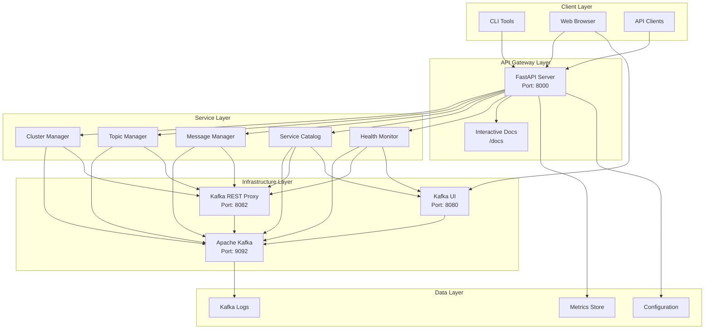
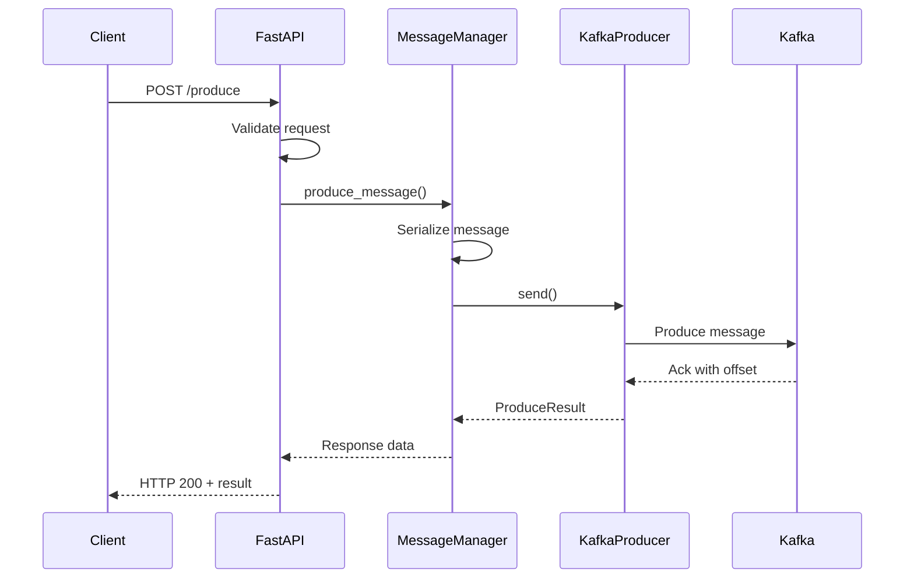
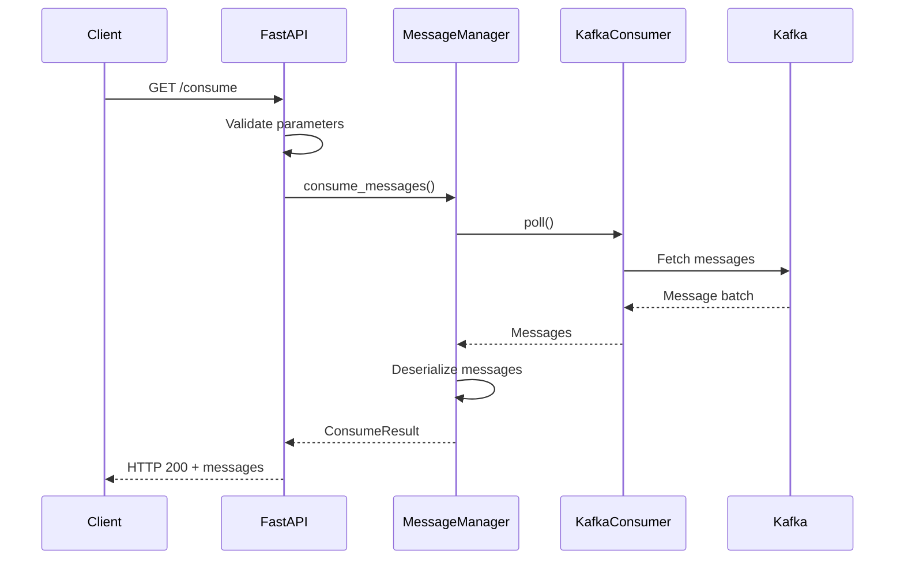
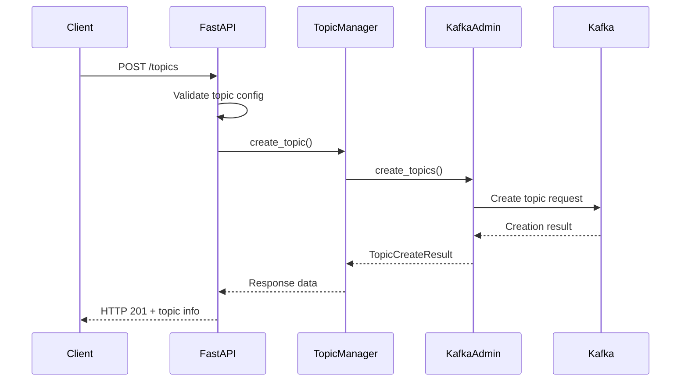
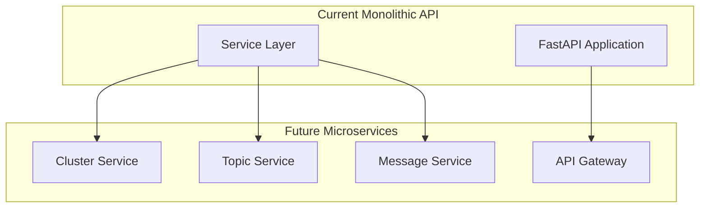

# 🏗️ Architecture Documentation

Comprehensive overview of Local Kafka Manager's architecture, design decisions, and implementation details.

## 📋 Table of Contents

- [System Overview](#system-overview)
- [Component Architecture](#component-architecture)
- [Data Flow](#data-flow)
- [API Design](#api-design)
- [Service Layer](#service-layer)
- [Error Handling](#error-handling)
- [Configuration Management](#configuration-management)
- [Testing Strategy](#testing-strategy)
- [Performance Considerations](#performance-considerations)
- [Security Architecture](#security-architecture)
- [Deployment Architecture](#deployment-architecture)

---

## 🌐 System Overview

Local Kafka Manager is designed as a microservices-based system that provides a comprehensive development environment for Apache Kafka. The architecture follows modern software engineering principles including separation of concerns, dependency injection, and clean architecture patterns.

### High-Level Architecture



### Design Principles

1. **Separation of Concerns**: Each component has a single, well-defined responsibility
2. **Dependency Injection**: Services are loosely coupled through dependency injection
3. **API-First Design**: All functionality is exposed through a consistent REST API
4. **Configuration-Driven**: Behavior is controlled through configuration files and environment variables
5. **Observability**: Comprehensive logging, metrics, and health checks
6. **Testability**: All components are designed to be easily testable
7. **Scalability**: Architecture supports horizontal scaling of API layer

---

## 🔧 Component Architecture

### FastAPI Application Layer

```python
# src/main.py - Application Entry Point
from fastapi import FastAPI
from src.api.routes import router
from src.middleware.logging_middleware import LoggingMiddleware
from src.config.settings import get_settings

app = FastAPI(
    title="Local Kafka Manager",
    description="REST API for Kafka management",
    version="1.0.0"
)

# Middleware stack
app.add_middleware(LoggingMiddleware)

# Route registration
app.include_router(router)
```

**Responsibilities:**
- HTTP request/response handling
- Route registration and middleware management
- OpenAPI documentation generation
- CORS and security policy enforcement

### API Layer

```python
# src/api/routes.py - Route Definitions
from fastapi import APIRouter, Depends
from src.services.cluster_manager import ClusterManager
from src.services.topic_manager import TopicManager
from src.services.message_manager import MessageManager

router = APIRouter()

@router.get("/cluster/status")
async def get_cluster_status(
    cluster_manager: ClusterManager = Depends()
):
    return await cluster_manager.get_status()
```

**Responsibilities:**
- HTTP endpoint definitions
- Request validation and serialization
- Response formatting
- Dependency injection coordination

### Service Layer

The service layer implements the core business logic and is organized into specialized managers:

#### Cluster Manager
```python
# src/services/cluster_manager.py
class ClusterManager:
    def __init__(self, kafka_client: KafkaClient, rest_proxy_client: RestProxyClient):
        self.kafka_client = kafka_client
        self.rest_proxy_client = rest_proxy_client
    
    async def get_status(self) -> ClusterStatus:
        """Get comprehensive cluster status"""
        # Implementation details...
    
    async def start_cluster(self) -> ClusterStartResult:
        """Start Kafka cluster services"""
        # Implementation details...
```

**Responsibilities:**
- Kafka cluster lifecycle management
- Service health monitoring
- Cluster configuration management
- Resource utilization tracking

#### Topic Manager
```python
# src/services/topic_manager.py
class TopicManager:
    def __init__(self, kafka_admin_client: KafkaAdminClient):
        self.admin_client = kafka_admin_client
    
    async def create_topic(self, topic_config: TopicConfig) -> TopicCreateResult:
        """Create a new Kafka topic"""
        # Implementation details...
    
    async def list_topics(self) -> List[TopicInfo]:
        """List all available topics"""
        # Implementation details...
```

**Responsibilities:**
- Topic lifecycle management (CRUD operations)
- Topic configuration management
- Partition and replication management
- Topic metadata retrieval

#### Message Manager
```python
# src/services/message_manager.py
class MessageManager:
    def __init__(self, kafka_producer: KafkaProducer, kafka_consumer: KafkaConsumer):
        self.producer = kafka_producer
        self.consumer = kafka_consumer
    
    async def produce_message(self, message: MessageRequest) -> ProduceResult:
        """Produce a message to Kafka"""
        # Implementation details...
    
    async def consume_messages(self, consume_request: ConsumeRequest) -> ConsumeResult:
        """Consume messages from Kafka"""
        # Implementation details...
```

**Responsibilities:**
- Message production and consumption
- Batch operations
- Message serialization/deserialization
- Consumer group management

### Data Models

```python
# src/models/ - Pydantic Models
from pydantic import BaseModel, Field
from typing import Optional, List, Dict, Any
from datetime import datetime

class TopicConfig(BaseModel):
    name: str = Field(..., description="Topic name")
    partitions: int = Field(default=3, ge=1, description="Number of partitions")
    replication_factor: int = Field(default=1, ge=1, description="Replication factor")
    config: Optional[Dict[str, str]] = Field(default=None, description="Topic configuration")

class MessageRequest(BaseModel):
    topic: str = Field(..., description="Target topic")
    key: Optional[str] = Field(default=None, description="Message key")
    value: Dict[str, Any] = Field(..., description="Message value")
    headers: Optional[Dict[str, str]] = Field(default=None, description="Message headers")
```

**Responsibilities:**
- Data validation and serialization
- Type safety and documentation
- Request/response schema definition
- Business rule enforcement

---

## 🔄 Data Flow

### Message Production Flow



### Message Consumption Flow



### Topic Management Flow



---

## 🎯 API Design

### RESTful Design Principles

The API follows REST architectural constraints:

1. **Resource-Based URLs**: `/topics`, `/messages`, `/cluster`
2. **HTTP Methods**: GET (read), POST (create), PUT (update), DELETE (delete)
3. **Stateless**: Each request contains all necessary information
4. **Cacheable**: Responses include appropriate cache headers
5. **Uniform Interface**: Consistent request/response patterns

### API Versioning Strategy

```python
# Future versioning support
app.include_router(v1_router, prefix="/v1")
app.include_router(v2_router, prefix="/v2")

# Default to latest version
app.include_router(v2_router)
```

### Response Format Standardization

```python
# src/models/responses.py
class APIResponse(BaseModel):
    success: bool = True
    data: Optional[Any] = None
    message: str = "Operation completed successfully"
    timestamp: datetime = Field(default_factory=datetime.utcnow)
    
class ErrorResponse(BaseModel):
    success: bool = False
    error: ErrorDetail
    timestamp: datetime = Field(default_factory=datetime.utcnow)
```

### Content Negotiation

```python
# Support for multiple content types
@app.middleware("http")
async def content_negotiation_middleware(request: Request, call_next):
    accept_header = request.headers.get("accept", "application/json")
    
    if "application/xml" in accept_header:
        # Handle XML response
        pass
    elif "text/plain" in accept_header:
        # Handle plain text response
        pass
    
    response = await call_next(request)
    return response
```

---

## 🛠️ Service Layer

### Dependency Injection Pattern

```python
# src/dependencies.py
from functools import lru_cache
from src.config.settings import Settings
from src.services.cluster_manager import ClusterManager

@lru_cache()
def get_settings() -> Settings:
    return Settings()

def get_cluster_manager(settings: Settings = Depends(get_settings)) -> ClusterManager:
    return ClusterManager(
        kafka_bootstrap_servers=settings.kafka_bootstrap_servers,
        rest_proxy_url=settings.kafka_rest_proxy_url
    )
```

### Service Interface Design

```python
# src/interfaces/service_interface.py
from abc import ABC, abstractmethod
from typing import Any, Dict

class ServiceInterface(ABC):
    @abstractmethod
    async def health_check(self) -> Dict[str, Any]:
        """Check service health status"""
        pass
    
    @abstractmethod
    async def get_metrics(self) -> Dict[str, Any]:
        """Get service metrics"""
        pass
```

### Error Handling Strategy

```python
# src/services/base_service.py
from src.utils.retry import retry_with_backoff
from src.exceptions import KafkaConnectionError, ServiceUnavailableError

class BaseService:
    @retry_with_backoff(max_retries=3, backoff_factor=2.0)
    async def _execute_with_retry(self, operation):
        try:
            return await operation()
        except ConnectionError as e:
            raise KafkaConnectionError(f"Failed to connect to Kafka: {e}")
        except Exception as e:
            raise ServiceUnavailableError(f"Service operation failed: {e}")
```

---

## ❌ Error Handling

### Exception Hierarchy

```python
# src/exceptions.py
class KafkaManagerException(Exception):
    """Base exception for all Kafka Manager errors"""
    pass

class KafkaConnectionError(KafkaManagerException):
    """Raised when Kafka connection fails"""
    pass

class TopicNotFoundError(KafkaManagerException):
    """Raised when topic doesn't exist"""
    pass

class InvalidConfigurationError(KafkaManagerException):
    """Raised when configuration is invalid"""
    pass
```

### Global Exception Handler

```python
# src/api/error_handlers.py
from fastapi import HTTPException, Request
from fastapi.responses import JSONResponse

@app.exception_handler(KafkaConnectionError)
async def kafka_connection_error_handler(request: Request, exc: KafkaConnectionError):
    return JSONResponse(
        status_code=503,
        content={
            "success": False,
            "error": {
                "code": "KAFKA_CONNECTION_ERROR",
                "message": str(exc),
                "type": "connection_error"
            }
        }
    )
```

### Retry Mechanism

```python
# src/utils/retry.py
import asyncio
from functools import wraps
from typing import Callable, Any

def retry_with_backoff(max_retries: int = 3, backoff_factor: float = 2.0):
    def decorator(func: Callable) -> Callable:
        @wraps(func)
        async def wrapper(*args, **kwargs) -> Any:
            last_exception = None
            
            for attempt in range(max_retries):
                try:
                    return await func(*args, **kwargs)
                except Exception as e:
                    last_exception = e
                    if attempt < max_retries - 1:
                        wait_time = backoff_factor ** attempt
                        await asyncio.sleep(wait_time)
                    
            raise last_exception
        return wrapper
    return decorator
```

---

## ⚙️ Configuration Management

### Settings Architecture

```python
# src/config/settings.py
from pydantic import BaseSettings, Field
from typing import List, Optional

class Settings(BaseSettings):
    # API Configuration
    api_host: str = Field(default="0.0.0.0", env="API_HOST")
    api_port: int = Field(default=8000, env="API_PORT")
    api_workers: int = Field(default=1, env="API_WORKERS")
    
    # Kafka Configuration
    kafka_bootstrap_servers: str = Field(default="localhost:9092", env="KAFKA_BOOTSTRAP_SERVERS")
    kafka_rest_proxy_url: str = Field(default="http://localhost:8082", env="KAFKA_REST_PROXY_URL")
    
    # Security Configuration
    cors_origins: List[str] = Field(default=["*"], env="CORS_ORIGINS")
    api_key_required: bool = Field(default=False, env="API_KEY_REQUIRED")
    
    class Config:
        env_file = ".env"
        env_file_encoding = "utf-8"
```

### Environment-Specific Configuration

```python
# src/config/environments.py
from enum import Enum

class Environment(str, Enum):
    DEVELOPMENT = "development"
    TESTING = "testing"
    STAGING = "staging"
    PRODUCTION = "production"

def get_environment_settings(env: Environment) -> Settings:
    if env == Environment.PRODUCTION:
        return ProductionSettings()
    elif env == Environment.TESTING:
        return TestingSettings()
    else:
        return DevelopmentSettings()
```

---

## 🧪 Testing Strategy

### Test Architecture

```
tests/
├── unit/                    # Unit tests for individual components
│   ├── test_services/      # Service layer tests
│   ├── test_models/        # Model validation tests
│   └── test_utils/         # Utility function tests
├── integration/            # Integration tests
│   ├── test_api_routes.py  # API endpoint tests
│   └── test_kafka_integration.py
├── e2e/                    # End-to-end tests
│   └── test_complete_workflows.py
└── performance/            # Performance tests
    └── test_load_scenarios.py
```

### Test Fixtures and Mocking

```python
# tests/conftest.py
import pytest
from unittest.mock import AsyncMock
from src.services.cluster_manager import ClusterManager

@pytest.fixture
def mock_kafka_client():
    mock = AsyncMock()
    mock.list_topics.return_value = ["test-topic-1", "test-topic-2"]
    return mock

@pytest.fixture
def cluster_manager(mock_kafka_client):
    return ClusterManager(kafka_client=mock_kafka_client)
```

### Test Categories

1. **Unit Tests**: Test individual functions and classes in isolation
2. **Integration Tests**: Test component interactions
3. **End-to-End Tests**: Test complete user workflows
4. **Performance Tests**: Test system performance under load
5. **Contract Tests**: Test API contract compliance

---

## ⚡ Performance Considerations

### Async/Await Pattern

```python
# Async service implementation
class MessageManager:
    async def produce_message(self, message: MessageRequest) -> ProduceResult:
        # Non-blocking I/O operations
        result = await self.producer.send(
            topic=message.topic,
            key=message.key,
            value=message.value
        )
        return ProduceResult(offset=result.offset, partition=result.partition)
```

### Connection Pooling

```python
# src/clients/kafka_client.py
from kafka import KafkaProducer, KafkaConsumer
from typing import Dict, Any

class KafkaClientPool:
    def __init__(self, bootstrap_servers: str, pool_size: int = 10):
        self.bootstrap_servers = bootstrap_servers
        self.producer_pool = []
        self.consumer_pool = {}
        
        # Pre-create producer connections
        for _ in range(pool_size):
            producer = KafkaProducer(
                bootstrap_servers=bootstrap_servers,
                value_serializer=lambda v: json.dumps(v).encode('utf-8')
            )
            self.producer_pool.append(producer)
```

### Caching Strategy

```python
# src/utils/cache.py
from functools import lru_cache
from typing import List
import asyncio

class TopicCache:
    def __init__(self, ttl: int = 300):  # 5 minutes TTL
        self.cache = {}
        self.ttl = ttl
    
    @lru_cache(maxsize=128)
    async def get_topic_list(self) -> List[str]:
        # Cache topic list to reduce Kafka admin calls
        return await self._fetch_topics_from_kafka()
```

### Resource Management

```python
# src/utils/resource_manager.py
import asyncio
from contextlib import asynccontextmanager

class ResourceManager:
    @asynccontextmanager
    async def kafka_producer(self):
        producer = None
        try:
            producer = await self._create_producer()
            yield producer
        finally:
            if producer:
                await producer.close()
```

---

## 🔒 Security Architecture

### Authentication Layer

```python
# src/security/auth.py
from fastapi import HTTPException, Depends
from fastapi.security import HTTPBearer, HTTPAuthorizationCredentials

security = HTTPBearer()

async def verify_api_key(credentials: HTTPAuthorizationCredentials = Depends(security)):
    if not is_valid_api_key(credentials.credentials):
        raise HTTPException(status_code=401, detail="Invalid API key")
    return credentials.credentials
```

### Input Validation

```python
# src/models/validators.py
from pydantic import validator
import re

class TopicConfig(BaseModel):
    name: str
    
    @validator('name')
    def validate_topic_name(cls, v):
        if not re.match(r'^[a-zA-Z0-9._-]+$', v):
            raise ValueError('Topic name contains invalid characters')
        if len(v) > 249:
            raise ValueError('Topic name too long')
        return v
```

### Rate Limiting

```python
# src/middleware/rate_limiting.py
from slowapi import Limiter, _rate_limit_exceeded_handler
from slowapi.util import get_remote_address

limiter = Limiter(key_func=get_remote_address)

@app.route("/produce")
@limiter.limit("100/minute")
async def produce_message(request: Request):
    # Implementation
    pass
```

---

## 🚀 Deployment Architecture

### Container Architecture

```dockerfile
# Multi-stage build for optimization
FROM python:3.11-slim as builder
WORKDIR /app
COPY requirements.txt .
RUN pip install --no-cache-dir -r requirements.txt

FROM python:3.11-slim as runtime
WORKDIR /app
COPY --from=builder /usr/local/lib/python3.11/site-packages /usr/local/lib/python3.11/site-packages
COPY src/ ./src/
EXPOSE 8000
CMD ["uvicorn", "src.main:app", "--host", "0.0.0.0", "--port", "8000"]
```

### Service Discovery

```yaml
# docker-compose.yml - Service networking
version: '3.8'
services:
  api:
    build: .
    environment:
      - KAFKA_BOOTSTRAP_SERVERS=kafka:9092
      - KAFKA_REST_PROXY_URL=http://kafka-rest-proxy:8082
    depends_on:
      - kafka
      - kafka-rest-proxy
    networks:
      - kafka-network

networks:
  kafka-network:
    driver: bridge
```

### Health Check Implementation

```python
# src/health/health_checker.py
from typing import Dict, Any
import asyncio

class HealthChecker:
    async def check_all_services(self) -> Dict[str, Any]:
        checks = await asyncio.gather(
            self.check_kafka_connectivity(),
            self.check_rest_proxy_health(),
            self.check_kafka_ui_health(),
            return_exceptions=True
        )
        
        return {
            "kafka": checks[0],
            "rest_proxy": checks[1],
            "kafka_ui": checks[2],
            "overall_status": self._determine_overall_status(checks)
        }
```

---

## 📊 Monitoring and Observability

### Metrics Collection

```python
# src/utils/metrics.py
from prometheus_client import Counter, Histogram, Gauge
import time

# Define metrics
REQUEST_COUNT = Counter('api_requests_total', 'Total API requests', ['method', 'endpoint'])
REQUEST_DURATION = Histogram('api_request_duration_seconds', 'Request duration')
ACTIVE_CONNECTIONS = Gauge('kafka_active_connections', 'Active Kafka connections')

class MetricsCollector:
    def record_request(self, method: str, endpoint: str, duration: float):
        REQUEST_COUNT.labels(method=method, endpoint=endpoint).inc()
        REQUEST_DURATION.observe(duration)
```

### Structured Logging

```python
# src/utils/logging.py
import structlog
import json

def configure_logging():
    structlog.configure(
        processors=[
            structlog.stdlib.filter_by_level,
            structlog.stdlib.add_logger_name,
            structlog.stdlib.add_log_level,
            structlog.stdlib.PositionalArgumentsFormatter(),
            structlog.processors.TimeStamper(fmt="iso"),
            structlog.processors.StackInfoRenderer(),
            structlog.processors.format_exc_info,
            structlog.processors.JSONRenderer()
        ],
        context_class=dict,
        logger_factory=structlog.stdlib.LoggerFactory(),
        wrapper_class=structlog.stdlib.BoundLogger,
        cache_logger_on_first_use=True,
    )
```

---

## 🔄 Future Architecture Considerations

### Microservices Evolution



### Event-Driven Architecture

```python
# Future event-driven implementation
class EventBus:
    async def publish_event(self, event: DomainEvent):
        await self.kafka_producer.send(
            topic=f"events.{event.aggregate_type}",
            key=event.aggregate_id,
            value=event.to_dict()
        )
    
    async def subscribe_to_events(self, event_type: str, handler: EventHandler):
        # Event subscription implementation
        pass
```

### Scalability Patterns

1. **Horizontal Scaling**: Multiple API instances behind load balancer
2. **Database Sharding**: Partition data across multiple Kafka clusters
3. **Caching Layer**: Redis for frequently accessed data
4. **Message Queuing**: Background job processing with Celery
5. **Circuit Breaker**: Fault tolerance for external service calls

---

*This architecture documentation provides a comprehensive overview of the system design. For implementation details, refer to the source code and additional documentation files.*